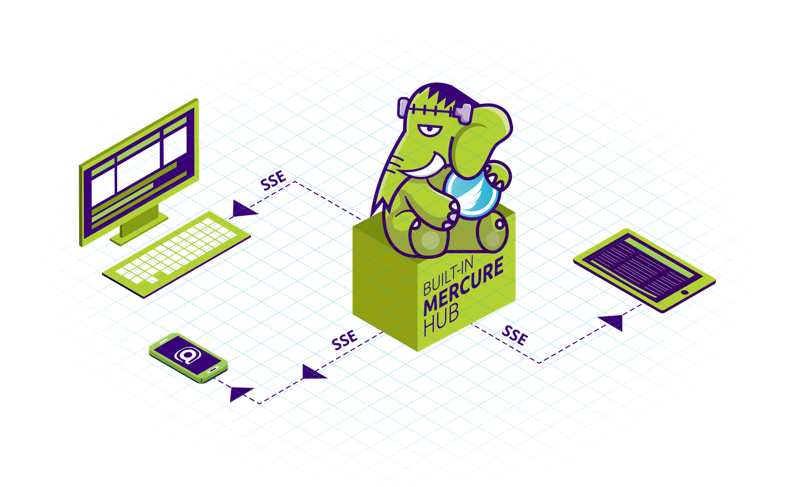

FrankenPHP yerleşik bir [Mercure](https://mercure.rocks) hub ile birlikte gelir!
Mercure, olayları tüm bağlı cihazlara gerçek zamanlı olarak göndermeye olanak tanır: anında bir JavaScript olayı alırlar.

JS kütüphanesi veya SDK gerekmez!

Mercure hub'ını etkinleştirmek için [Mercure'ün sitesinde](https://mercure.rocks/docs/hub/config) açıklandığı gibi `Caddyfile`'ı güncelleyin.

Mercure güncellemelerini kodunuzdan göndermek için [Symfony Mercure Bileşenini](https://symfony.com/components/Mercure) öneririz (kullanmak için Symfony tam yığın çerçevesine ihtiyacınız yoktur).
